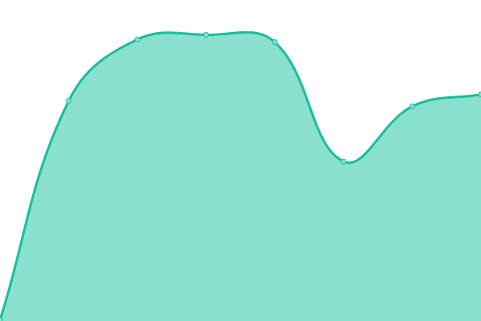

# [📈 Live Status](https://statusbeta.sdsetup.com): <!--live status--> **🟩 All systems operational**

This repository contains the open-source uptime monitor and status page for [noahc3](https://www.sdsetup.com), powered by [Upptime](https://github.com/upptime/upptime).

With [Upptime](https://upptime.js.org), you can get your own unlimited and free uptime monitor and status page, powered entirely by a GitHub repository. We use [Issues](https://github.com/noahc3/SDSetupStatus/issues) as incident reports, [Actions](https://github.com/noahc3/SDSetupStatus/actions) as uptime monitors, and [Pages](https://statusbeta.sdsetup.com) for the status page.

<!--start: status pages-->
<!-- This summary is generated by Upptime (https://github.com/upptime/upptime) -->
<!-- Do not edit this manually, your changes will be overwritten -->
<!-- prettier-ignore -->
| URL | Status | History | Response Time | Uptime |
| --- | ------ | ------- | ------------- | ------ |
|  [SDSetup Frontend](https://www.sdsetup.com) | 🟩 Up | [sd-setup-frontend.yml](https://github.com/noahc3/SDSetupStatus/commits/HEAD/history/sd-setup-frontend.yml) | 

 92ms
     
 | 

<a href="https://statusbeta.sdsetup.com/history/sd-setup-frontend">100.00%</a>
    

|  [SDSetup Backend](https://files.sdsetup.com/api/v1/get/latestpackageset) | 🟩 Up | [sd-setup-backend.yml](https://github.com/noahc3/SDSetupStatus/commits/HEAD/history/sd-setup-backend.yml) | 

 169ms
     
 | 

<a href="https://statusbeta.sdsetup.com/history/sd-setup-backend">100.00%</a>
    

|  [Switch Homebrew Guide](https://switch.homebrew.guide) | 🟩 Up | [switch-homebrew-guide.yml](https://github.com/noahc3/SDSetupStatus/commits/HEAD/history/switch-homebrew-guide.yml) | 

 104ms
     
 | 

<a href="https://statusbeta.sdsetup.com/history/switch-homebrew-guide">100.00%</a>
    

|  [PegaScape Landing](https://pegascape.sdsetup.com) | 🟩 Up | [pega-scape-landing.yml](https://github.com/noahc3/SDSetupStatus/commits/HEAD/history/pega-scape-landing.yml) | 

 106ms
     
 | 

<a href="https://statusbeta.sdsetup.com/history/pega-scape-landing">100.00%</a>
    

|  [PegaScape Selector (Prompt)](http://51.15.245.41) | 🟩 Up | [pega-scape-selector-prompt.yml](https://github.com/noahc3/SDSetupStatus/commits/HEAD/history/pega-scape-selector-prompt.yml) | 

 181ms
     
 | 

<a href="https://statusbeta.sdsetup.com/history/pega-scape-selector-prompt">100.00%</a>
    

|  [PegaScape DNS (Prompt)](51.15.245.41) | 🟩 Up | [pega-scape-dns-prompt.yml](https://github.com/noahc3/SDSetupStatus/commits/HEAD/history/pega-scape-dns-prompt.yml) | 

 88ms
     
 | 

<a href="https://statusbeta.sdsetup.com/history/pega-scape-dns-prompt">100.00%</a>
    

|  [PegaScape Selector (Applet)](http://163.172.181.170) | 🟩 Up | [pega-scape-selector-applet.yml](https://github.com/noahc3/SDSetupStatus/commits/HEAD/history/pega-scape-selector-applet.yml) | 

 180ms
     
 | 

<a href="https://statusbeta.sdsetup.com/history/pega-scape-selector-applet">100.00%</a>
    

|  [PegaScape DNS (Applet)](163.172.181.170) | 🟩 Up | [pega-scape-dns-applet.yml](https://github.com/noahc3/SDSetupStatus/commits/HEAD/history/pega-scape-dns-applet.yml) | 

 87ms
     
 | 

<a href="https://statusbeta.sdsetup.com/history/pega-scape-dns-applet">100.00%</a>
    

<!--end: status pages-->

[**Visit our status website →**](https://statusbeta.sdsetup.com)

## 📄 License

- Powered by: [Upptime](https://github.com/upptime/upptime)
- Code: [MIT](./LICENSE) © [noahc3](https://www.sdsetup.com)
- Data in the `./history` directory: [Open Database License](https://opendatacommons.org/licenses/odbl/1-0/)
